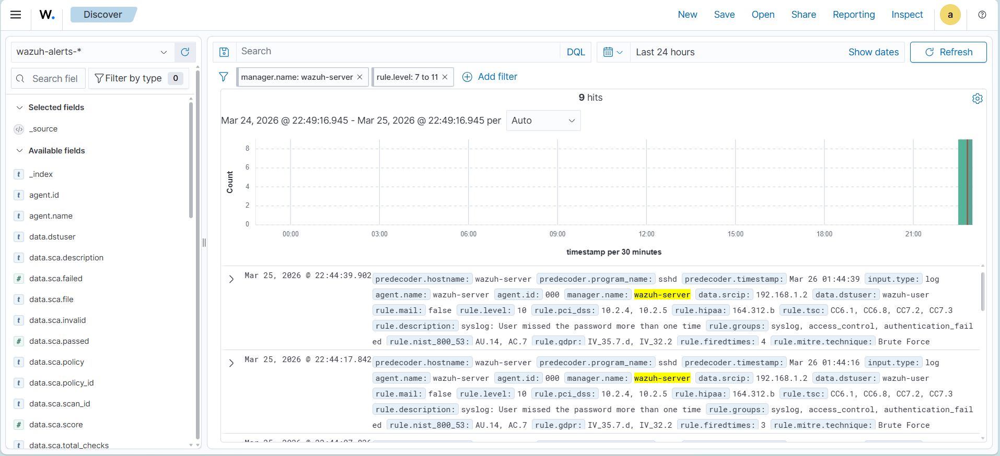
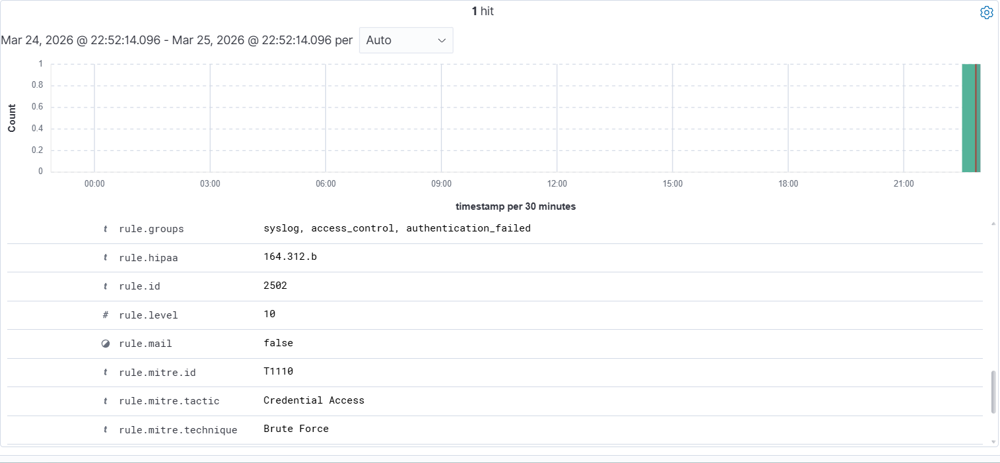

# Lab — Detecção de Brute Force SSH com Wazuh SIEM

## O que é esse projeto

Durante meus estudos práticos de Blue Team com foco SOC, montei esse lab para ir além
da teoria, queria ver com os próprios olhos como um SIEM reage a um
ataque real de brute force. A ideia foi simples, configurar o Wazuh,
simular o ataque e entender o que acontece do ponto de vista do
defensor.

O resultado foi mais completo do que esperava. O Wazuh não só detectou
as tentativas, ele correlacionou o comportamento, escalou a severidade
automaticamente e mapeou o ataque direto no MITRE ATT&CK sem nenhuma
configuração manual minha. Isso me mostrou na prática como um analista
de SOC recebe um alerta já contextualizado, pronto para triagem.

---

## Ambiente

| Componente | Detalhe |
|---|---|
| SIEM | Wazuh 4.x (OVA oficial) |
| Virtualização | VirtualBox |
| Sistema da VM | Ubuntu (imagem oficial Wazuh) |
| IP do alvo | 192.168.1.25 |
| IP do atacante | 192.168.1.2 (host local) |

---

## O que eu fiz

Habilitei o serviço SSH na VM do Wazuh e simulei tentativas consecutivas
de autenticação com credenciais inválidas a partir do meu host local
reproduzindo o comportamento de um atacante na rede tentando obter
acesso por força bruta.

Não usei nenhuma ferramenta automatizada. As tentativas foram geradas
manualmente para que eu pudesse acompanhar em tempo real como o Wazuh
reagia a cada evento.

---

## O que o Wazuh detectou

Aqui está o ponto mais interessante do lab: o Wazuh não alertou em cima
de uma senha errada isolada. Ele esperou acumular o padrão, múltiplas
falhas de autenticação dentro de uma janela de tempo, e só então
escalou o alerta para brute force com severidade média (level 10).

Esse comportamento é exatamente o que diferencia um SIEM de um simples
sistema de log. Ele raciocina sobre o comportamento, não só sobre o
evento.

### Detalhes do alerta gerado

| Campo | Valor |
|---|---|
| rule.id | 2502 |
| rule.level | 10 (Medium Severity) |
| rule.description | syslog: User missed the password more than one time |
| rule.groups | syslog, access_control, authentication_failed |
| rule.firedtimes | 4 |
| data.srcip | 192.168.1.2 |
| data.dstuser | wazuh-user |
| predecoder.program_name | sshd |

---

## Mapeamento MITRE ATT&CK

O que mais me surpreendeu foi o mapeamento automático. Sem nenhuma
configuração da minha parte, o Wazuh classificou o ataque dentro da
matriz MITRE ATT&CK:

| Campo | Valor |
|---|---|
| rule.mitre.id | T1110 |
| rule.mitre.tactic | Credential Access |
| rule.mitre.technique | Brute Force |

Na prática, isso significa que quando esse alerta chega para um analista
N1 num SOC real, ele já sabe exatamente com qual tática e técnica está
lidando — o que acelera muito a triagem e a tomada de decisão.

---

## Evidências

### Painel de alertas — múltiplos eventos correlacionados

### Detalhe expandido — mapeamento MITRE ATT&CK automático

---

## Cobertura regulatória detectada automaticamente

Um detalhe que não esperava: o Wazuh também mapeou os eventos para
frameworks de conformidade automaticamente, sem nenhuma configuração
adicional.

| Framework | Controle |
|---|---|
| PCI DSS | 10.2.4, 10.2.5 |
| HIPAA | 164.312.b |
| NIST 800-53 | AU.14, AC.7 |
| GDPR | IV_35.7.d, IV_32.2 |
| TSC | CC6.1, CC6.8, CC7.2, CC7.3 |

Isso me fez perceber que num ambiente corporativo, o mesmo alerta que
o analista de SOC usa para responder ao incidente também alimenta
automaticamente os relatórios de compliance — algo que antes eu só
entendia na teoria.

---

## O que aprendi

Montar esse lab me deu uma visão concreta de como funciona o trabalho
do analista N1 num SOC: você não está caçando eventos um por um — você
está interpretando alertas que o SIEM já correlacionou e contextualizou.
Saber o que está por trás desse alerta, como ele foi gerado e o que ele
representa no MITRE é o que separa uma triagem rápida de uma investigação
que trava.

---

## Referências

- [Wazuh Documentation](https://documentation.wazuh.com)
- [MITRE ATT&CK — T1110 Brute Force](https://attack.mitre.org/techniques/T1110/)
- [NIST SP 800-61 — Computer Security Incident Handling Guide](https://nvlpubs.nist.gov/nistpubs/SpecialPublications/NIST.SP.800-61r2.pdf)
